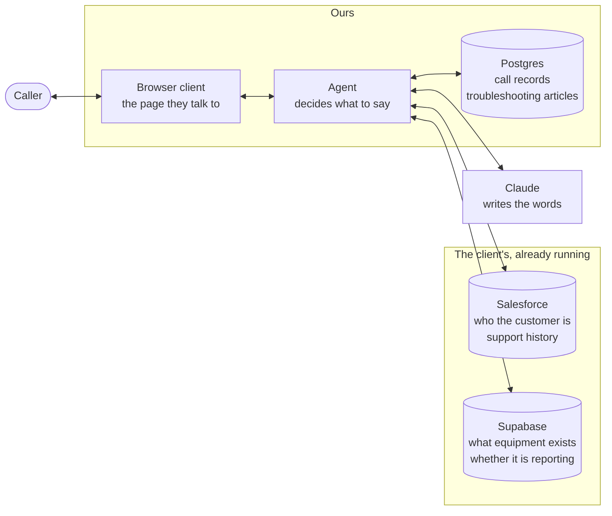
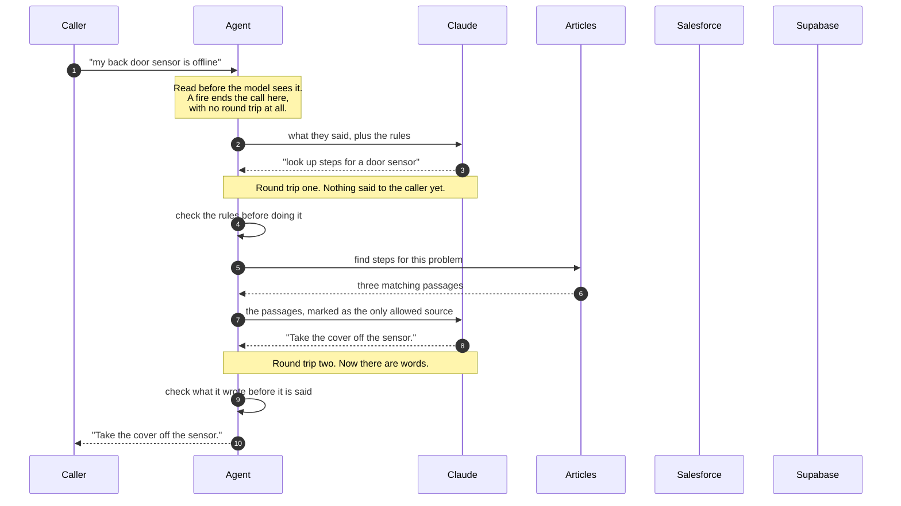
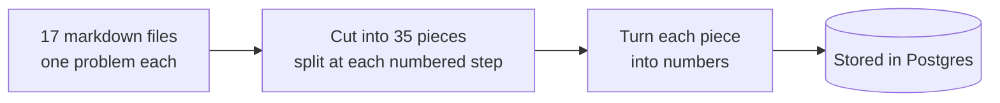
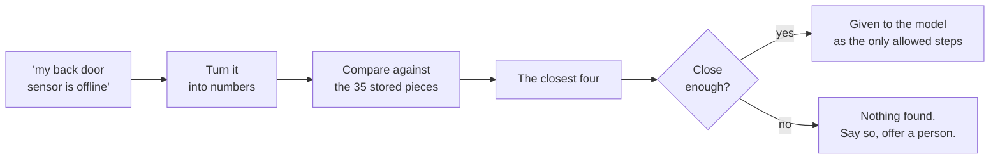
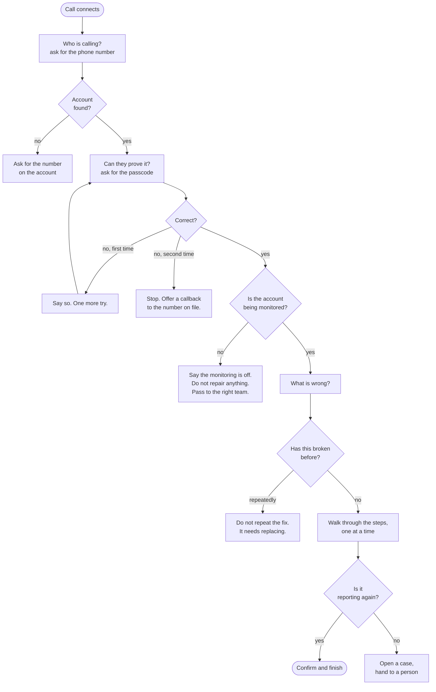
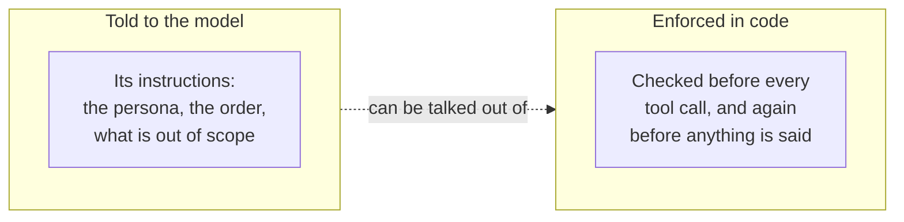
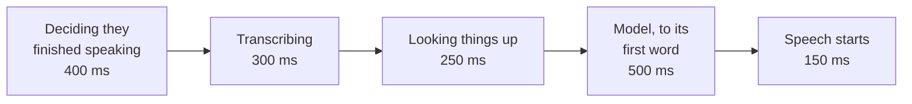

# How Wren works

Wren answers a support call. Someone rings up because a sensor in their house
has stopped working, and it tries to get them to a working sensor without a
person having to pick up.

This walks through what happens, from the words arriving to the words going
back. No code needed.

## The words used here

A few terms come up throughout.

**A turn** is one exchange: the caller says something, the agent replies.

**A round trip** is sending a message to another computer and waiting for its
answer. Like posting a letter. You cannot do anything until the reply arrives,
so every round trip costs time.

**A tool call** is the agent asking for something it cannot know by itself — who
this caller is, whether their sensor is reporting, what has gone wrong before.

**A lookup** is one search of the troubleshooting articles.

**An embedding** is a piece of text turned into a list of numbers, arranged so
that text about similar things produces similar numbers. It is what lets
"my sensor is dead" find an article titled "Sensor showing offline", which
shares none of the same words.

---

## The shape of it

Four systems. Only two belong to this project.

The split matters. Customer records and equipment state belong to systems this
project does not own, exactly as they would in a real deployment. Copying them
locally would mean answering from a stale copy about whether a sensor is
currently reporting, and that is the one thing this agent cannot be wrong about.

What Wren owns is small: the record of its own conversations, and the
troubleshooting articles it is allowed to read from.

---

## One turn, end to end

The caller says *"my back door sensor is offline"*. Here is everything that
happens before they hear a reply.

Two things in that picture are the whole design.

**The agent decides, not the model.** The model proposes a tool call. The agent
checks it against the rules and the state of the call, and may refuse. A refusal
goes back to the model as an ordinary result explaining why, so the conversation
carries on in the right direction rather than being cut off.

**Two round trips for one reply.** The model has to be asked twice: once to find
out what it wants, and again once it has the answer. The caller waits through
both. This, not the speed of the model, is why a turn takes seconds.

---

## Where the articles come from

Everything the agent says about fixing something comes from 17 markdown files.
It is not allowed to invent a step.

Those files go through two separate journeys, and confusing them is the easiest
mistake to make here.

### Once, before any call

Run once at setup, and again only when an article is edited. Splitting happens
at the numbered steps rather than every so many words, because a cut that lands
mid-instruction means the agent later reads out half a step.

Each piece carries its article's title and its symptom phrases — the words a
*caller* would use, not the words a technician would.

### Every time a caller describes a problem

The same method turns both an article and a caller's sentence into numbers. It
has to be the same one, or comparing them would be like subtracting inches from
centimetres.

**The "close enough" check is the important part.** If nothing is similar
enough, the agent gets nothing, and having nothing is what makes it say it
cannot help rather than improvising. The threshold was picked by measurement:
correct matches score no lower than 0.61, and questions with no answer here peak
at 0.59, so it sits between them.

---

## The order a call has to happen in

The sequence is not a formality. Each step exists because skipping it causes a
specific harm.

**Why verification comes before anything is said.** The caller's name, address,
plan and equipment list all confirm to a stranger that this household holds an
account here. That is worth something to someone who should not have it.

**Why two attempts and not three.** Two survives a mis-hearing. Three starts
helping someone work through possibilities. After the second failure the agent
does not even say what was wrong with the guess, because that narrows the next
one.

**Why the monitoring check comes before any repair.** This is the one that is
easy to get backwards. If someone's service has stopped, their equipment is not
being watched by anyone. Walking them through fixing a sensor produces a caller
who hangs up believing they are protected while nobody is listening. That is
worse than telling them plainly that they are not.

**Why repeat failures stop the repair.** Equipment that has been fixed three
times and has broken again is not going to be fixed a fourth time by the same
instructions. Someone needs to replace it.

---

## What it will not do, and where that is enforced

Every rule exists in two places. The agent is told about it, and the code
enforces it separately.

The instructions are the weaker layer. A model can be argued out of an
instruction, and will occasionally decide that being helpful matters more than a
constraint. So the same rules are checked around it:

| Rule | What it prevents |
|---|---|
| Nothing about the account before verification | Confirming to a stranger that this household has an account |
| Stop after two failed passcodes | A third guess being useful to someone guessing |
| No repair on an unmonitored account | A caller believing they are protected when nobody is watching |
| No repeating a repair that has already failed | A fourth round of instructions that were never going to work |
| No instruction that did not come from an article | Confident, invented repair steps for someone's alarm system |
| Nothing about billing, contracts or cancelling | Improvising about money |
| No promise of a time, a cost, or a visit | Committing to something nobody agreed to |

Every one of those has a test that deliberately tries to break it.

Where a judgement is unclear, the restrictive answer wins. Refusing something
reasonable costs a transfer. Allowing something unsafe does not undo.

---

## Where the time goes

A turn should take about a second. Longer and the pause is audible; much longer
and it reads as a dropped call.

Measured against the real systems, the parts behave roughly as budgeted — except
the model, and not because it is slow.

**A turn needing two tool calls costs two round trips to the model**, and the
caller waits through both. That is the dominant cost, and it is why turns land
around four seconds rather than one.

Three things are done about it:

- **Everything is fetched at once**, the moment the caller is verified. That is
  a pause they already expect, and it saves separate lookups later.
- **The agent speaks while it works.** If an answer is not ready in 700
  milliseconds, it says so, rather than leaving the line silent.
- **Speech begins on the first finished sentence**, not the finished reply, so
  the caller hears the opening while the rest is still being written.

Every stage of every turn is recorded and can be read back on the calls page,
each against what it was allowed.

---

## Why this shape and not a simpler one

The obvious alternative is a single model that takes audio in and produces audio
out, with no text in the middle. It is faster and it sounds more natural.

It was not used because a support agent has to look things up, open tickets, and
be reviewable afterwards. That needs reliable tool calling and a transcript, and
those are what the middle step provides. The extra latency buys the ability to
audit every call and to be certain of what was said.
